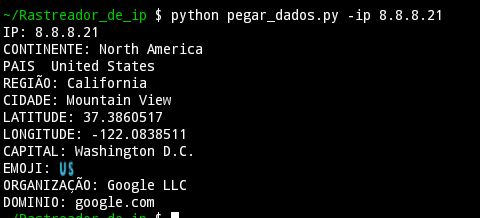

# Rastreador_de_ip

> :memo: **Note:** Usando em python

> pkg install git
 >>git clone https://github.com/sombo20/Rastreador_de_ip
 1. cd Rastreador_de_ip
 2. Rastreador_de_ip > python pegar_dados.py -ip endereço_ip_aqui
 3. Rastreador_de_ip > python pegar_dados.py -ip 8.8.8.8

## Exemplo da saída 

